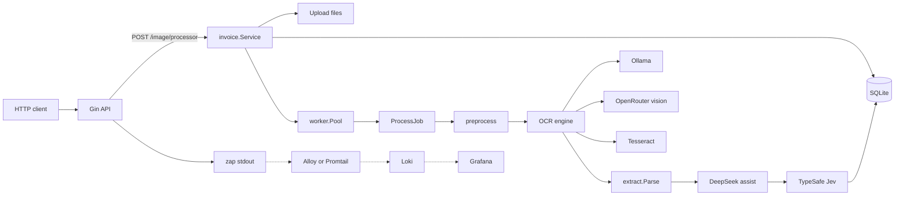

# invoice-ocr-poc

Proof of concept HTTP API: upload a receipt, optionally preprocess, then call **only HTTP APIs**.

Default OCR in `.env.example` is **Ollama** (`glm-ocr:latest` via `POST /api/generate`). OpenRouter vision remains available.

Then DeepSeek (OpenRouter) extracts line items and TypeSafe Jev judges type, routing, and risk.

## Architecture

Upload returns as soon as the file is on disk and the invoice is queued. A worker pool runs preprocess, OCR, optional DeepSeek assist, and Jev. Results stay in SQLite. Structured logs go to stdout (`zap`); `LOG_FORMAT=json` is the scrape path for a later Grafana Loki collector.



`OCR_ENGINE` selects one OCR backend (`ollama`, `openrouter`, or `tesseract`). Assist is skipped when `OPENROUTER_API_KEY` is empty. Dashed edges are not wired in this PoC.

## Requirements

- Go 1.27.1
- Ollama with `glm-ocr:latest` (`ollama pull glm-ocr:latest`)
- `OPENROUTER_API_KEY` — optional structured extract (and OCR if `OCR_ENGINE=openrouter`)
- `TYPESAFE_API_KEY` — Jev
- Optional: `go build -tags gocv` for OpenCV preprocess

## Run

```bash
cp configs/.env.example .env
# set OPENROUTER_API_KEY and TYPESAFE_API_KEY
go run ./cmd/api
```

`OCR_ENGINE=ollama` (example), `openrouter`, or `tesseract`.

`LOG_FORMAT=text` (default, console) or `json` (stdout lines for a later Grafana Loki collector).

## API

- `GET /health`
- `POST /api/v1/image/processor`
- `GET /api/v1/invoices/:id`
- `GET /api/v1/invoices/:id/analysis`
- `GET /api/v1/invoices`

```bash
curl -s -X POST http://localhost:8080/api/v1/image/processor \
  -F "image=@./receipt.png;type=image/png"
```

Flow: preprocess → Ollama GLM-OCR (or OpenRouter) → DeepSeek JSON → Jev HTTP.

## Accuracy harness

```bash
go test -tags evaluation ./test/
```
