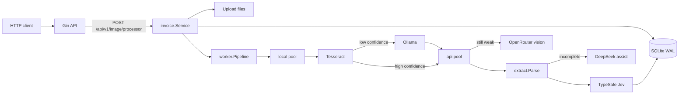

# invoice-ocr-poc

Proof of concept HTTP API: upload a receipt image, enqueue processing, then poll SQLite-backed results.

OCR is a **confidence cascade**: Tesseract, then local Ollama (`glm-ocr:latest`), then OpenRouter vision. DeepSeek (OpenRouter) optionally extracts line items when the parse is still incomplete. TypeSafe Jev judges document type, routing, and risk.

## Architecture


Upload returns as soon as the file is on disk and the invoice is queued. The client compresses the image; the backend **passthrough** reuses that file. A two-pool pipeline runs local OCR (Tesseract → Ollama) then API work (OpenRouter OCR fallback, optional DeepSeek assist, Jev). SQLite uses WAL with a single writer. Logs go to stdout (`zap`).



Sharp images stop on Tesseract. `WORKER_COUNT_LOCAL` and `WORKER_COUNT_API` isolate CPU/GPU from network calls. Assist is skipped when `OPENROUTER_API_KEY` is empty or the extract is already complete.

## Requirements

- Go 1.27.1
- Tesseract (`por+eng`) for the first cascade hop
- Ollama with `glm-ocr:latest` (`ollama pull glm-ocr:latest`) for the local fallback
- `OPENROUTER_API_KEY` — optional structured extract and Gemini OCR fallback
- `TYPESAFE_API_KEY` — Jev

## Run

```bash
cp configs/.env.example configs/.env
# set OPENROUTER_API_KEY and TYPESAFE_API_KEY
go run ./cmd/api
```

Config is read from `.env` or `configs/.env`.

`LOG_FORMAT=text` (default, console) or `json`.

`WORKER_COUNT_LOCAL` (alias `OCR_WORKERS`) is the Tesseract/Ollama pool. `WORKER_COUNT_API` (alias `JEV_WORKERS`) is OpenRouter/Assist/Jev. `JOB_QUEUE_SIZE` is the in-memory job buffer (default 32). `POST /api/v1/image/processor` returns 503 `job queue is full` when the buffer is full; the HTTP handler does not wait for a worker.

Set `DEBUG_PPROF=true` to expose `net/http/pprof` on `DEBUG_PPROF_ADDR` (default `127.0.0.1:6060`). It is not mounted on the public API port.

## API

- `GET /health`
- `POST /api/v1/image/processor`
- `GET /api/v1/invoices/:id`
- `GET /api/v1/invoices/:id/analysis`
- `GET /api/v1/invoices`

```bash
curl -s -X POST http://localhost:8080/api/v1/image/processor \
  -F "image=@./path/to/receipt.png;type=image/png"
```

Flow: passthrough upload → Tesseract → Ollama if weak → OpenRouter OCR if still weak → optional DeepSeek → Jev HTTP.

## OCR Cache

When `OCR_CACHE_ENABLED=true` (default), results are cached by OCR text hash. A cache hit skips Ollama, OpenRouter, Assist, and Jev entirely — only Tesseract runs (~100ms). TTL is `OCR_CACHE_TTL` (default `1h`).

## Profiling with pprof

Set `DEBUG_PPROF=true` to expose `net/http/pprof` on `DEBUG_PPROF_ADDR` (default `127.0.0.1:6060`).

### CPU profile (30 seconds)

```bash
curl -o cpu.prof http://127.0.0.1:6060/debug/pprof/profile?seconds=30
go tool pprof -http=:8081 cpu.prof
```

### Heap

```bash
curl -o heap.prof http://127.0.0.1:6060/debug/pprof/heap
go tool pprof -http=:8081 heap.prof
```

### Goroutines

```bash
curl http://127.0.0.1:6060/debug/pprof/goroutine?debug=2
```

### Execution trace (5 seconds)

```bash
curl -o trace.out http://127.0.0.1:6060/debug/pprof/trace?seconds=5
go tool trace trace.out
```

### Flame graph with pprof web UI

```bash
go tool pprof -http=:8081 http://127.0.0.1:6060/debug/pprof/profile?seconds=30
```

This opens a browser with flame graphs, top functions, and call graphs.

## Accuracy harness

```bash
go test -tags evaluation ./test/
```
