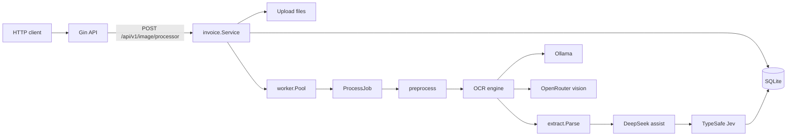

# invoice-ocr-poc

Proof of concept HTTP API: upload a receipt image, enqueue processing, then poll SQLite-backed results.

OCR is **Ollama** (`glm-ocr:latest`) or **OpenRouter** vision. DeepSeek (OpenRouter) optionally extracts line items. TypeSafe Jev judges document type, routing, and risk.

## Architecture

Upload returns as soon as the file is on disk and the invoice is queued. A worker pool runs preprocess (resize to 1600px max side, JPEG quality 80), OCR, optional DeepSeek assist, and Jev. Results stay in SQLite. Logs go to stdout (`zap`).



`OCR_ENGINE` selects one OCR backend (`ollama` or `openrouter`). Assist is skipped when `OPENROUTER_API_KEY` is empty.

## Requirements

- Go 1.27.1
- Ollama with `glm-ocr:latest` (`ollama pull glm-ocr:latest`) when `OCR_ENGINE=ollama`
- `OPENROUTER_API_KEY` — optional structured extract (and OCR if `OCR_ENGINE=openrouter`)
- `TYPESAFE_API_KEY` — Jev

## Run

```bash
cp configs/.env.example configs/.env
# set OPENROUTER_API_KEY and TYPESAFE_API_KEY
go run ./cmd/api
```

Config is read from `.env` or `configs/.env`.

`OCR_ENGINE=ollama` (example) or `openrouter`.

`LOG_FORMAT=text` (default, console) or `json`.

`WORKER_COUNT` is the OCR goroutine count (default 2). `JOB_QUEUE_SIZE` is the in-memory job buffer (default 32). `POST /api/v1/image/processor` returns 503 `job queue is full` when the buffer is full; the HTTP handler does not wait for a worker.

## API

- `GET /health`
- `POST /api/v1/image/processor`
- `GET /api/v1/invoices/:id`
- `GET /api/v1/invoices/:id/analysis`
- `GET /api/v1/invoices`

```bash
curl -s -X POST http://localhost:8080/api/v1/image/processor \
  -F "image=@./path/to/receipt.png;type=image/png"
```

Flow: preprocess (resize/JPEG) → OCR (Ollama or OpenRouter) → extract / optional DeepSeek → Jev HTTP.

## Accuracy harness

```bash
go test -tags evaluation ./test/
```
