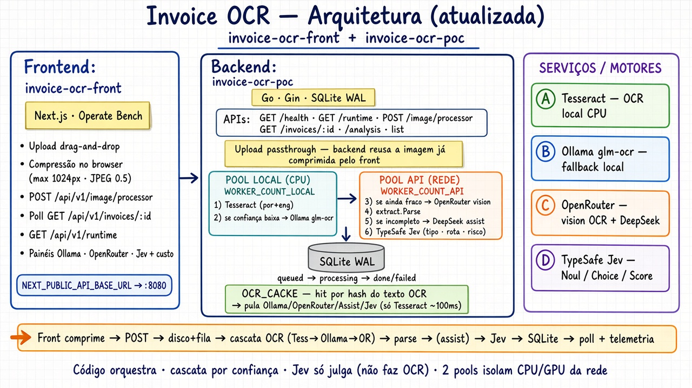

# invoice-ocr-poc

Proof of concept HTTP API: upload a receipt image, enqueue processing, then poll SQLite-backed results.

OCR is provided by a selectable engine: local Tesseract or Ollama (`glm-ocr:latest`), or OpenRouter vision. DeepSeek (via OpenRouter) can optionally assist with line-item extraction. TypeSafe Jev judges document type, routing, and risk.

## Architecture



Current flow (matches the code):
- The frontend compresses the image in the browser and POSTs it; the backend stores the bytes as-is (passthrough) and immediately enqueues work.
- A single fixed-size worker pool executes:
  1) preprocess a working copy (downscale to max 1600px and JPEG Q=80 when beneficial),
  2) OCR with the configured engine (`OCR_ENGINE=tesseract|ollama|openrouter`),
  3) parse totals and items (`extract.Parse`),
  4) optional DeepSeek assist via OpenRouter to improve items,
  5) TypeSafe Jev to classify document type, routing, and risk.
- Results are persisted in SQLite via GORM; the HTTP API only reads/writes through the service layer.
- Logs are structured with `zap` to stdout.

`/api/v1/runtime` exposes the configured OCR engine and model names. Assist is skipped when `OPENROUTER_API_KEY` is empty. Jev requires `TYPESAFE_API_KEY`.

## Requirements

- Go 1.27.1
- Optional local engines:
  - Tesseract binary on PATH when `OCR_ENGINE=tesseract`
  - Ollama with `glm-ocr:latest` (`ollama pull glm-ocr:latest`) when `OCR_ENGINE=ollama`
- Cloud engines/features:
  - `OPENROUTER_API_KEY` — required for OCR when `OCR_ENGINE=openrouter`; also enables DeepSeek assist
  - `TYPESAFE_API_KEY` — required for Jev

## Run

```bash
cp configs/.env.example configs/.env
# set OPENROUTER_API_KEY and TYPESAFE_API_KEY as needed
go run ./cmd/api
```

Configuration is read from `.env` or `configs/.env`.

`OCR_ENGINE` can be `openrouter` (default), `ollama`, or `tesseract`.

`LOG_FORMAT=text` (default, console) or `json`.

`WORKER_COUNT` is the OCR goroutine count (default 2). `JOB_QUEUE_SIZE` is the in-memory job buffer (default 32). `POST /api/v1/image/processor` returns 503 `job queue is full` when the buffer is full; the HTTP handler does not wait for a worker.

## API

- `GET /health`
- `GET /api/v1/runtime`
- `POST /api/v1/image/processor`
- `GET /api/v1/invoices/:id`
- `GET /api/v1/invoices/:id/analysis`
- `GET /api/v1/invoices`

```bash
curl -s -X POST http://localhost:8080/api/v1/image/processor \
  -F "image=@./path/to/receipt.png;type=image/png"
```

Processing: preprocess (resize/JPEG working copy) → OCR (engine selected by `OCR_ENGINE`) → extract → optional DeepSeek assist → Jev.

## Environment

The service reads these keys (see `internal/config` and `configs/.env.example` for defaults):

- Core: `PORT`, `SQLITE_PATH`, `UPLOAD_DIR`, `MAX_UPLOAD_BYTES`, `WORKER_COUNT`, `JOB_QUEUE_SIZE`, `LOG_FORMAT`
- OCR selection: `OCR_ENGINE` (`openrouter` default), `TESSERACT_LANG`
- Ollama (local OCR): `OLLAMA_URL`, `OLLAMA_OCR_MODEL`, `OLLAMA_TIMEOUT`
- OpenRouter (vision OCR and DeepSeek assist): `OPENROUTER_API_KEY`, `OPENROUTER_BASE_URL`, `OPENROUTER_OCR_MODEL`, `OPENROUTER_MODEL`, `OPENROUTER_TIMEOUT`
- TypeSafe Jev: `TYPESAFE_API_KEY`, `TYPESAFE_BASE_URL`, `TYPESAFE_TIMEOUT`

## Accuracy harness

```bash
go test -tags evaluation ./test/
```
